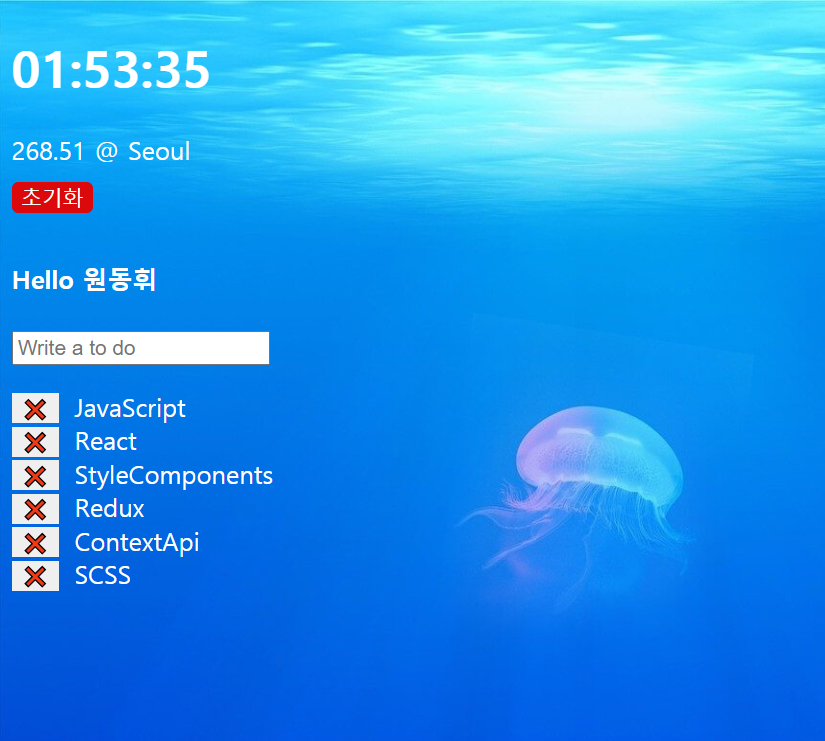

# Momentum

## < 기술 스택 > 
## vanila JavaScript

<b>vanila JavaScript를 이용해</b>

<b>localStorage에 저장되는 TodoList 작성</b>

반복 -> ForEach문 사용 , 
생성 -> Push 사용 , 
삭제 -> filter 사용 ,

[웹페이지 바로가기](https://wondonghwi.github.io/Momentum_JS/)

preview 

